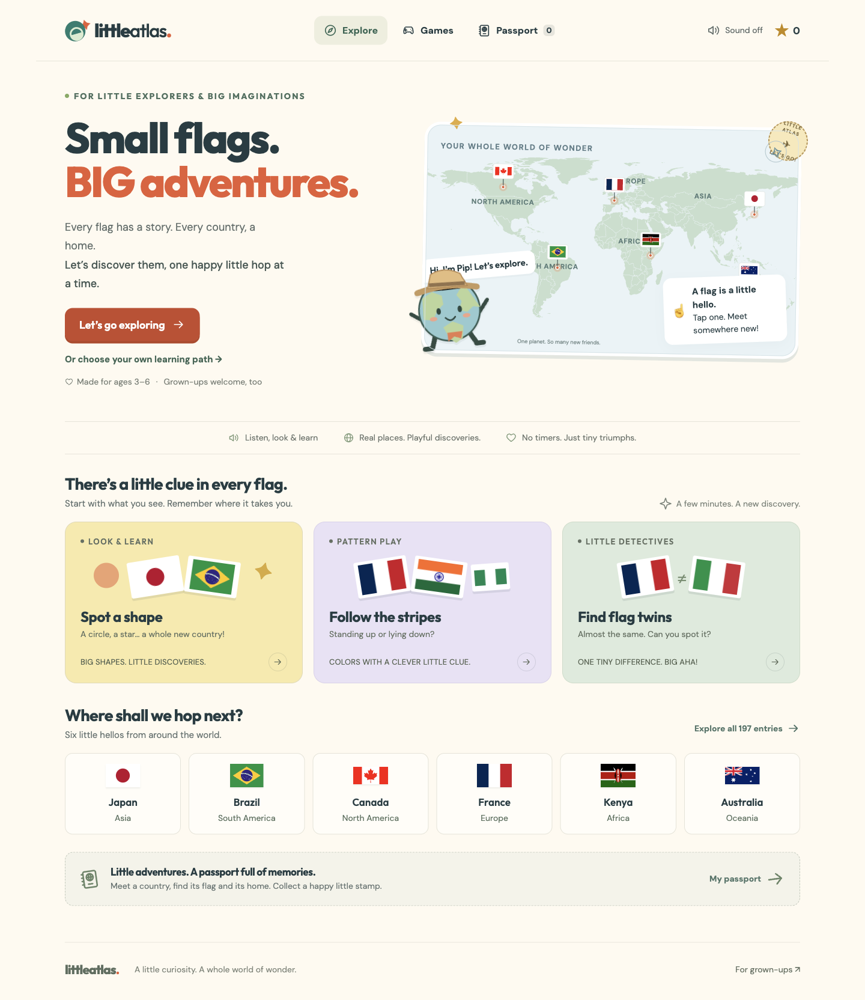

# Little Atlas

**Small flags. Big adventures.** A colorful, gentle way to learn country flags and geography with little explorers and their grown-ups.

**[Open the app](https://littleatlas.pages.dev/)** · **[Architecture](ARCHITECTURE.md)** · **[Data sources & conventions](data/README.md)**



## Run

Node 24+ and Python 3.9+:

```sh
npm ci
npm run dev
# http://little-atlas.localhost:1355
```

The site uses local flags, maps, fonts, and recorded narration. No runtime account, analytics, microphone, database, or AI service. Existing passport progress stays in your browser.

## What is here

- All 195 UN member/observer states, plus clearly labeled Taiwan and Kosovo entries.
- Visual memory clues, country locations, gentle practice, and passport stamps.
- Sourced flag stories, language and belief context, land neighbors, and time zones for the full atlas.
- 11 learning paths: A–Z, continents, colors, shapes, bands, look-alikes, neighbors, languages, clocks, first steps, and unvisited places.
- Six configurable games, including neighbor hops, clock buddies, and memory postcards.
- Explicit transcontinental/convention handling—Türkiye’s Asia and Europe are never opposing quiz answers.
- 627 local narration clips, including the flag stories; larger text and prominent region badges.

## Develop and verify

```sh
npm run check       # strict types + source checks
npm run test:unit   # meaningful domain/data invariants
npm test            # browser journeys; install Playwright Chromium first
npm run build       # allowlisted static release in dist/
```

If this Mac cannot launch a test Chromium instance, use an already-running test browser:

```sh
ATLAS_CDP=http://127.0.0.1:9223 npm test
```

Read **[AGENTS.md](AGENTS.md)** and **[ARCHITECTURE.md](ARCHITECTURE.md)** before adding features. Work ring-first, test behavior first, and prefer a shared function over another implementation.

## Data and narration

```sh
npm run data:fetch  # pinned public source snapshots; local ignored cache
npm run data:build  # regenerate the attributed catalog
```

`npm run audio:generate` requires the separately configured `~/bin/tts.py`; credentials are never shipped. Existing MP3s are included. Generation uses a paid service; playback does not.

Source credits: Natural Earth (public domain); mledoze/countries (ODbL); archived CIA World Factbook text (public domain); IANA tzdb; FlagCDN/Flagpedia and Wikimedia flag artwork; Outfit and DM Sans (SIL OFL). Sources and exceptions are linked in the data guide and country records. Simplified maps are illustrative, not boundary endorsements.

## Publish

`npm run deploy` checks types, formatting, and unit/data rules, then publishes **only `dist/`** to Cloudflare Pages. Authenticate Wrangler first and run browser tests before deploying. See **[DEPLOYMENT.md](DEPLOYMENT.md)** for the production project, live checks, and rollback.
